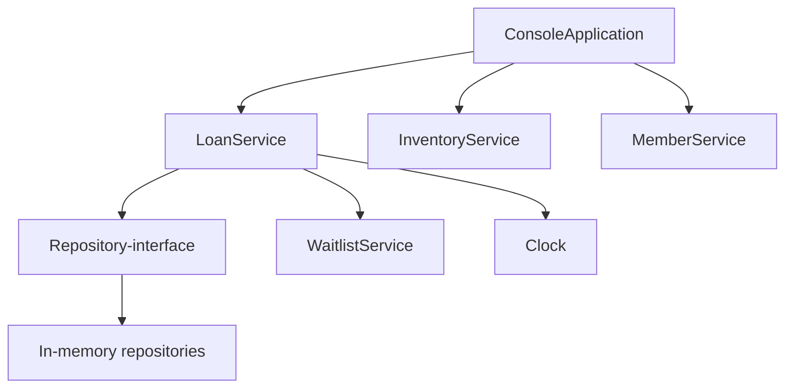
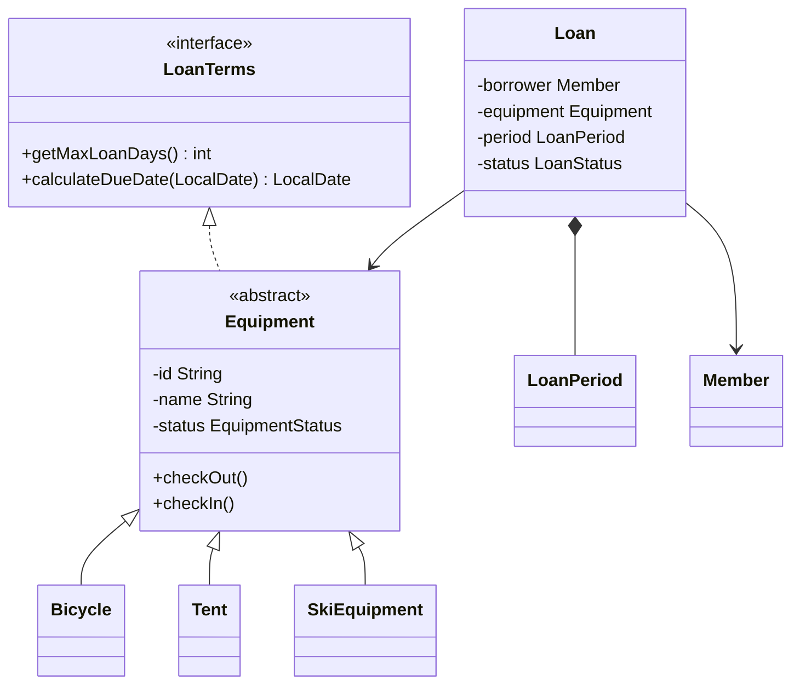

# Design och klassöversikt

## Huvudflöde

## Domänmodell

## Väntelisteflöde

1. Ett aktivt lån avslutas av registrerad låntagare.
2. Sen återlämning beräknas mot förfallodatum.
3. Utrustningen markeras tillgänglig.
4. Första medlems-ID hämtas med FIFO `poll()`.
5. Medlemsstatus och antal aktiva lån kontrolleras igen.
6. Obehörig medlem tas bort permanent och nästa kontrolleras.
7. Första behöriga medlem får ett automatiskt lån med returdatumet som nytt
   lånedatum.
8. Om ingen kan låna förblir utrustningen tillgänglig.

## Varför status finns på utrustningen

Kravet säger att varje utrustningsobjekt ska ha tillgänglighetsstatus. Därför
äger `Equipment` sin status och skyddar övergångarna med `checkOut()` och
`checkIn()`. `LoanService` är den enda produktionstjänst som utför dessa
övergångar och kontrollerar samtidigt aktiva lån i repositoryt. Tester verifierar
att status och lån förblir synkroniserade efter både lyckade och nekade
operationer.

## Utbyggbarhet

En ny typ, exempelvis `Kayak`, behöver endast:

1. ärva `Equipment`;
2. ange `getMaxLoanDays()`;
3. ange `getTypeName()`;
4. läggas till som val i registreringsmenyn.

Låneservice, datumlogik, statistik och rapport behöver inte känna till typen.
Det följer Open/Closed Principle.
